

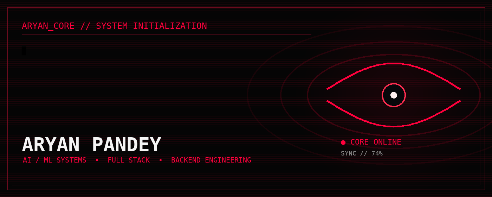

 

  

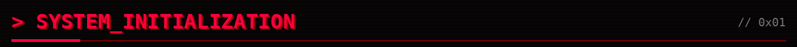
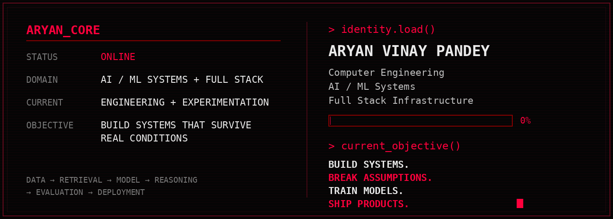

Computer Engineering student building AI systems, intelligent document processing, retrieval and production backends. Not just integrating models — understanding the whole system.

  

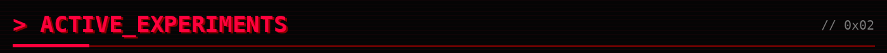

<table>
<tr>
<td width="50%"><a href="https://github.com/AVP2011/CareBridge_AI">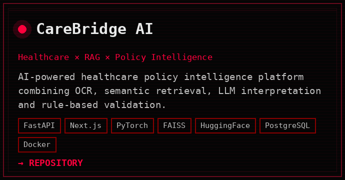</a></td>
<td width="50%"><a href="https://github.com/AVP2011/AstraGuard">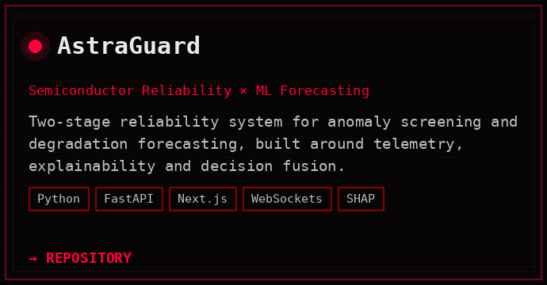</a></td>
</tr>
<tr>
<td width="50%"><a href="https://github.com/AVP2011">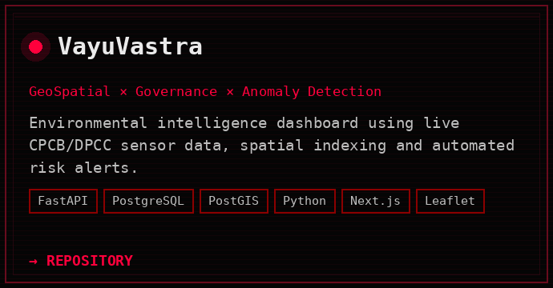</a></td>
<td width="50%"><a href="https://github.com/AVP2011">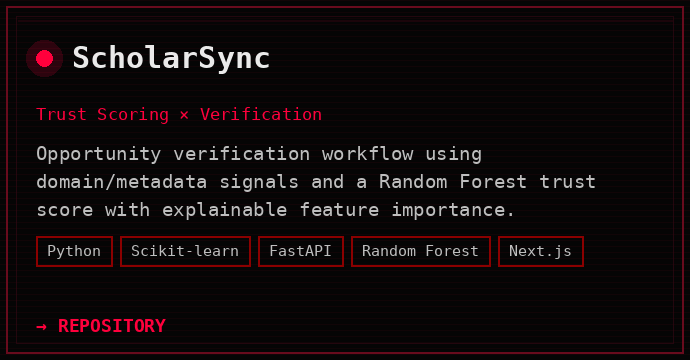</a></td>
</tr>
</table>

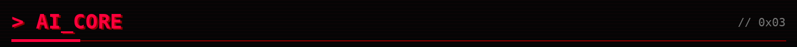
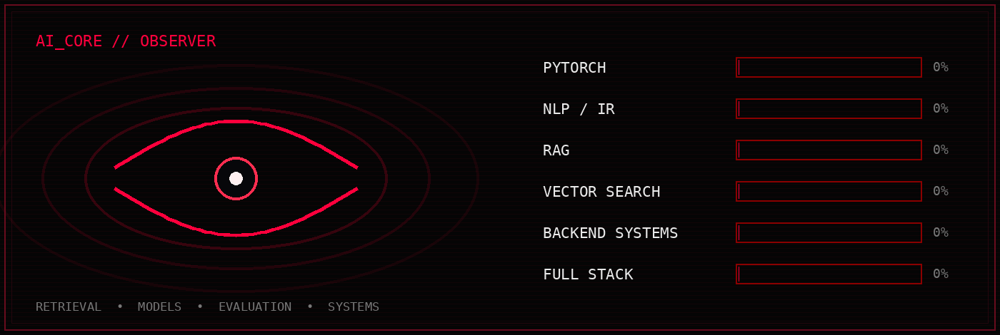

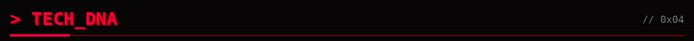
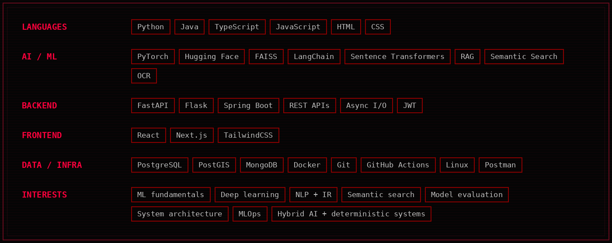

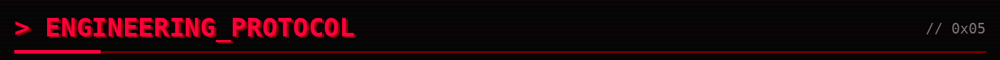
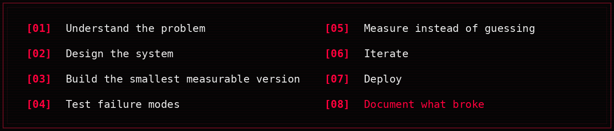

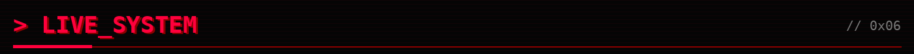
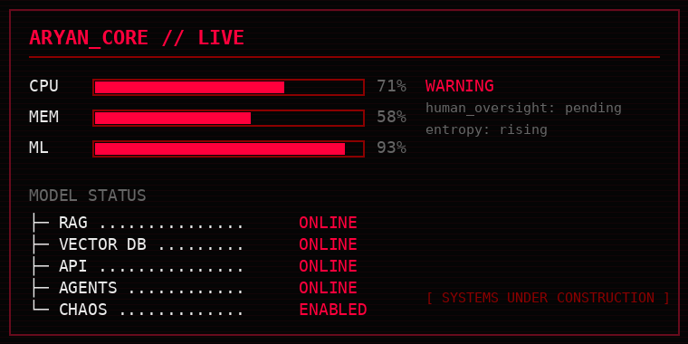

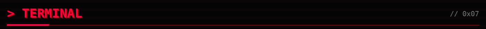

 

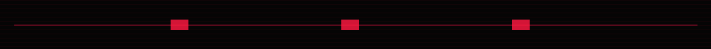

**☠ IF YOU FOUND SOMETHING INTERESTING, OPEN THE CORE.**

